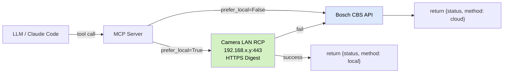
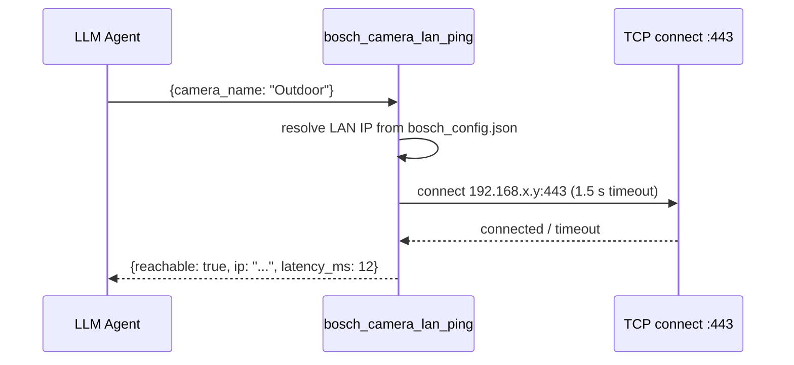

# Bosch Smart Home Camera — MCP Server

> **Model Context Protocol (MCP) server** that exposes the Bosch Smart Home Camera cloud API
> as MCP tools. Drop-in for Claude Code, Claude Desktop, and any MCP-compatible client.
> Reuses the proven reverse-engineered API client from the sister
> [Python CLI tool](https://github.com/mosandlt/Bosch-Smart-Home-Camera-Tool-Python).
>
> **Status:** v1.3.0 — LAN-fallback feature set: `bosch_camera_lan_ping`, `prefer_local` on privacy/light writes, `recommended_action` on maintenance status (11 tools + 3 resources + 2 prompts, stdio/SSE/streamable-HTTP, pipx/uvx-installable)

[![License][license-shield]](LICENSE)
[![Project Maintenance][maintenance-shield]][user_profile]

[license-shield]: https://img.shields.io/badge/license-MIT-blue.svg?style=for-the-badge
[maintenance-shield]: https://img.shields.io/badge/maintainer-%40mosandlt-blue.svg?style=for-the-badge
[user_profile]: https://github.com/mosandlt

## Disclaimer

This project is an independent, community-developed tool. It is **not affiliated with, endorsed by, sponsored by, or in any way officially connected to Robert Bosch GmbH, Bosch Smart Home GmbH, or any of their subsidiaries or affiliates**. "Bosch", "Bosch Smart Home", and related names and logos are registered trademarks of Robert Bosch GmbH.

The tool communicates with a reverse-engineered, undocumented, unofficial API. Provided "as is", without warranty of any kind. Use entirely at your own risk.

## Why a separate MCP server?

The sister projects target different runtimes:

| Project | Runtime | User-facing surface |
|---|---|---|
| [HA Integration](https://github.com/mosandlt/Bosch-Smart-Home-Camera-Tool-HomeAssistant) | Home Assistant | UI entities, Lovelace card, automations |
| [Python CLI](https://github.com/mosandlt/Bosch-Smart-Home-Camera-Tool-Python) | terminal | `bosch_camera ...` commands |
| [ioBroker Adapter](https://github.com/mosandlt/iobroker.bosch-smart-home-camera) | ioBroker | datapoints, JSON-config admin UI |
| **MCP Server (this repo)** | **Claude clients** | **MCP tools callable from LLMs** |

LLM use-cases the existing sisters don't cover:
- "Take a snapshot of the garden camera and describe what you see."
- "What was the last motion event on the terrace, and at what time?"
- "Enable privacy mode on the indoor camera until 22:00, then disable it."
- "Pan the 360° camera to the left and grab a snapshot."
- "Summarise today's motion events across all cameras."

These flows require an LLM in the loop — which is exactly what MCP is for.

## Architecture

```
┌─────────────────────────┐      stdio / SSE / streamable HTTP      ┌─────────────────────────┐
│  Claude Code / Desktop  │ ←─────────────────────────────────────→ │  bosch-smart-home-      │
│  (MCP host)             │             MCP protocol                │  camera-mcp server      │
└─────────────────────────┘                                         └────────────┬────────────┘
                                                                                 │
                                                              imports / shared API client
                                                                                 │
                                                                                 ▼
                                                                  ┌─────────────────────────┐
                                                                  │ bosch_camera.py         │
                                                                  │ (sister Python CLI tool)│
                                                                  └────────────┬────────────┘
                                                                               │ HTTPS (OAuth2 PKCE)
                                                                               ▼
                                                                  ┌─────────────────────────┐
                                                                  │ residential.cbs.bosch-  │
                                                                  │ security.com (cloud)    │
                                                                  └─────────────────────────┘
```

The MCP server is a thin wrapper around the Python CLI's API layer. It does **not** re-implement OAuth, token refresh, FCM push, RTSP, or RCP — it imports them.

### LAN-fallback tool routing



### `bosch_camera_lan_ping` tool flow



## Planned MCP tools (v0.1.0)

| Tool | Description | Returns |
|---|---|---|
| `bosch_camera_list` | List all configured cameras | array of `{id, name, model, hw_version, status}` |
| `bosch_camera_status` | Get online/offline + privacy state for one camera | `{name, status, privacy_mode, light_on, last_event_at}` |
| `bosch_camera_snapshot` | LAN-only JPEG capture (no cloud) — HTTP Digest to camera IP | `{path, method, timestamp}` |
| `bosch_camera_stream_url` | LAN-only RTSPS stream URL (no cloud relay) — consumable by ffmpeg/VLC/go2rtc | `{camera, rtsps_url, note}` |
| `bosch_camera_events` | List recent motion/person/audio events | array of `{event_id, type, timestamp, has_clip}` |
| `bosch_camera_privacy_set` | Turn privacy mode on/off; `prefer_local=True` routes to LAN RCP first | `{name, status, privacy_mode, ...}` |
| `bosch_camera_light_set` | Turn spotlight on/off; `prefer_local=True` routes to LAN RCP first | `{name, status, light_on, ...}` |
| `bosch_camera_pan` | Pan the 360° camera | `{camera, position}` |
| `bosch_camera_notifications_set` | Toggle push notifications | `{camera, notifications_on}` |
| `bosch_camera_info` | Verbose camera info (firmware, IP, stream URLs) | full dict |
| `bosch_camera_lan_ping` | TCP-probe a camera on LAN port 443 (1.5 s timeout) | `{reachable, ip, latency_ms}` |
| `bosch_camera_maintenance_status` | Fetch current cloud maintenance announcement from community RSS feed | `{state, title, link, pub_date, summary, scheduled_start, scheduled_end, source, camera_relevant, recommended_action}` |

Tools intentionally NOT exposed to LLMs (write-risky / time-consuming):
- Live RTSP stream URLs (no LLM use case)
- Token refresh (handled silently by the underlying client)
- Camera sharing / friends (require user-driven flow)
- Cloud clip download (large payloads)
- Audio intercom (timing-sensitive)

## MCP resources

| Resource URI | Description |
|---|---|
| `bosch://cameras` | JSON list of all cameras (id, name, model, status, firmware, mac, description) |
| `bosch://cameras/{name}/snapshot.jpg` | Latest cached JPEG, or fresh capture if cache empty |
| `bosch://cameras/{name}/events` | Last 50 events (motion, person, audio) as JSON list |

`bosch://cameras` is a static resource. The `{name}` variants are resource templates.

## MCP prompts

| Prompt | Arguments | Description |
|---|---|---|
| `daily-camera-summary` | `hours: int = 24` | Multi-step report: events per camera, type breakdown, time distribution, anomaly highlights |
| `pre-leave-check` | _(none)_ | Snapshot every camera, describe scene, flag anomalies, recommend indoor privacy mode |

## Privacy stance — media operations are LAN-only

Snapshots and stream URLs go directly from the MCP host to the camera over the LAN — no Bosch cloud relay. The remaining tools (status, events, privacy/light/pan/notifications) still use the cloud because Bosch does not expose a local API for those yet (planned summer 2026).

| Tool | Path |
|---|---|
| `bosch_camera_snapshot` | LAN only — HTTP Digest to camera IP |
| `bosch_camera_stream_url` | LAN only — RTSPS via local Bosch TLS proxy |
| `bosch_camera_lan_ping` | LAN only — TCP connect to camera port 443 |
| `bosch_camera_list` / `status` / `events` | Bosch cloud (no local API yet) |
| `bosch_camera_privacy_set` / `light_set` (default) | Bosch cloud |
| `bosch_camera_privacy_set` / `light_set` (`prefer_local=True`) | LAN-RCP first, cloud fallback — Gen2 only |
| `bosch_camera_pan` / `notifications_set` | Bosch cloud (no local API yet) |

The MCP host must be on the same network as the cameras for media tools to work. If it isn't, the snapshot/stream tools surface `local_unavailable` rather than falling back to cloud — by design.

## Auth model

Server runs **with the user's existing `bosch_config.json`** from the sister Python tool — no separate OAuth flow. Two startup modes:

1. `--config-from-cli` (default): expects `bosch_config.json` next to `bosch_camera.py` in a sibling checkout
2. `--config <path>`: explicit path to a `bosch_config.json`

The MCP server never reads or writes credentials beyond what the CLI tool already does (token refresh on 401, atomic save).

## Transport modes

Three transport modes are supported via the `--transport` flag:

| Mode | Flag | Use case |
|---|---|---|
| `stdio` | `--transport stdio` (default) | Claude Code / Claude Desktop — local subprocess |
| `streamable-http` | `--transport http` | Remote / multi-client deployments over HTTP |
| `sse` | `--transport sse` | Legacy SSE clients |

HTTP and SSE modes bind to `127.0.0.1:8765` by default (security-safe local-only).
Pass `--http-host 0.0.0.0` only in trusted, firewalled network environments.

```bash
# stdio (default) — used by Claude Code / Claude Desktop
bosch-smart-home-camera-mcp --config ~/.config/bosch-camera/bosch_config.json

# streamable-HTTP — local port for multi-client use
bosch-smart-home-camera-mcp --transport http --http-port 8765

# streamable-HTTP — expose to LAN (ensure firewall rules!)
bosch-smart-home-camera-mcp --transport http --http-host 0.0.0.0 --http-port 8765
```

## Tech stack

- Python 3.10+
- [`mcp`](https://github.com/modelcontextprotocol/python-sdk) — official Anthropic Python SDK
- `pydantic` (already a transitive dep of `mcp`) for tool schemas
- Reuse: `bosch_camera.py` from sister repo as a Git submodule **or** as a Python import path

## Installation

```bash
# via pipx (recommended for end users — isolated environment, PATH entry)
pipx install bosch-smart-home-camera-mcp

# via uvx (zero-install, one-shot — no persistent env needed)
uvx bosch-smart-home-camera-mcp --help

# from source (for development)
pip install -e .[test]
```

### Add to Claude Code — stdio (local, recommended)

```bash
claude mcp add bosch-camera -- bosch-smart-home-camera-mcp \
  --config ~/.config/bosch-camera/bosch_config.json
```

### Add to Claude Code — streamable-HTTP (remote server)

```bash
# Start server first:
bosch-smart-home-camera-mcp --transport http --http-port 8765

# Then register the HTTP endpoint:
claude mcp add bosch-camera --transport http http://127.0.0.1:8765/mcp
```

## Repo layout

```
Bosch-Smart-Home-Camera-Tool-MCP/
├── README.md                         this file
├── LICENSE                           MIT
├── pyproject.toml                    build + tool config
├── requirements.txt                  runtime pins (mcp, etc.)
├── requirements-test.txt             pytest, pytest-asyncio, mocks
├── src/
│   └── bosch_camera_mcp/
│       ├── __init__.py
│       ├── server.py                 FastMCP server entrypoint
│       ├── tools/                    one file per tool group
│       │   ├── cameras.py
│       │   ├── snapshots.py
│       │   ├── events.py
│       │   └── controls.py
│       ├── resources.py
│       ├── prompts.py
│       └── config.py                 config loader, bridging to sister CLI
├── tests/
│   ├── conftest.py
│   └── test_tools_*.py
├── docs/
│   ├── architecture.md
│   ├── tools-reference.md
│   └── installation.md
└── .gitignore
```

## Roadmap

- **v0.1.0** — concept doc + skeleton server, all tools defined but not yet implemented (returns `NotImplementedError`) ✅
- **v0.2.0** — all 8 tools wired: read tools (list, status, events, snapshot) + write tools (privacy, light, pan, notifications) via sys.path injection (Option C) ✅
- **v0.4.0** — resources (`bosch://cameras`, `bosch://cameras/{name}/snapshot.jpg`, `bosch://cameras/{name}/events`) + prompts (`daily-camera-summary`, `pre-leave-check`) ✅
- **v0.5.0** — streamable-HTTP transport (`--transport http|sse|stdio`), packaging for `pipx`/`uvx`, 24 new tests ✅
- **v1.0.0** — first stable release: 106 tests, published wheel + sdist on GitHub Releases, PyPI publish pending ✅
- **v1.1.0** — LAN-only media path (privacy hardened): `bosch_camera_snapshot` and new `bosch_camera_stream_url` go directly to camera over LAN, no Bosch cloud relay for media. 113 tests. ✅
- **v1.2.0** — `bosch_camera_maintenance_status` tool: fetches cloud maintenance announcements from community RSS feeds; returns state (active/scheduled/past/recent/unknown/idle), title, time window, link. ✅
- **v1.3.0** — LAN-fallback feature set (ported from HA integration v12.4.10/v12.4.11): `bosch_camera_lan_ping` tool (TCP-probe any camera on LAN); `prefer_local=True` on `bosch_camera_privacy_set` / `bosch_camera_light_set` (RCP-LAN write path, Gen2, cloud fallback on failure); `recommended_action` field on `bosch_camera_maintenance_status` (`"check_lan"` when active, `"wait"` when scheduled). 173 tests. ✅
- **v1.4.0 (next)** — refactor sister CLI into importable `bosch_camera_lib` package (Option B), removing the sys.path injection

## License

MIT — see [LICENSE](LICENSE).
