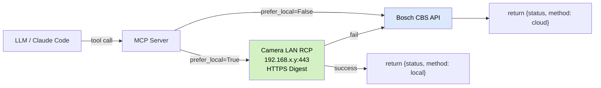
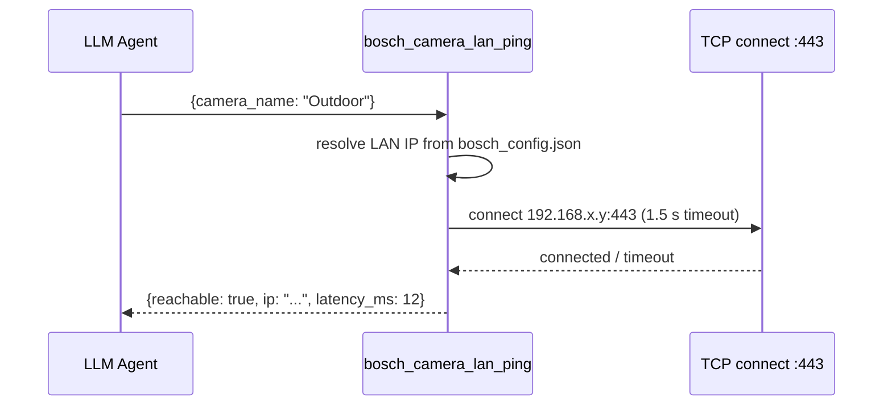

# Bosch Smart Home Camera — MCP Server

> **Model Context Protocol (MCP) server** that exposes the Bosch Smart Home Camera cloud API
> as MCP tools. Drop-in for Claude Code, Claude Desktop, and any MCP-compatible client.
> Reuses the proven reverse-engineered API client from the sister
> [Python CLI tool](https://github.com/mosandlt/Bosch-Smart-Home-Camera-Tool-Python).
>
> **Status:** v1.7.2 — family-parity closeout (v1.7.0): motion zones, privacy masks, automation rules, camera sharing/friends, firmware install, siren duration, lighting schedule, listen-audio intercom. Plus the 2026-08-19 image/video tuning + camera-lifecycle round: timestamp overlay, status LED, lens elevation, darkness threshold, white balance, top/bottom LED brightness, soft/hard reset, rename. 70 tools + 3 resources + 2 prompts, stdio/SSE/streamable-HTTP, pipx/uvx-installable

[![License][license-shield]](LICENSE)
[![Project Maintenance][maintenance-shield]][user_profile]

[license-shield]: https://img.shields.io/badge/license-MIT-blue.svg?style=for-the-badge
[maintenance-shield]: https://img.shields.io/badge/maintainer-%40mosandlt-blue.svg?style=for-the-badge
[user_profile]: https://github.com/mosandlt

---

## Table of Contents

- [Disclaimer](#disclaimer)
- [Why a separate MCP server?](#why-a-separate-mcp-server)
- [Architecture](#architecture)
- [MCP tools](#mcp-tools-70-total-v172)
- [MCP resources](#mcp-resources)
- [MCP prompts](#mcp-prompts)
- [Privacy stance](#privacy-stance--media-operations-are-lan-only)
- [Auth model](#auth-model)
- [Transport modes](#transport-modes)
- [Tech stack](#tech-stack)
- [Installation](#installation)
- [Repo layout](#repo-layout)
- [Release History](#release-history)
- [Releases](#releases) · [Full changelog](CHANGELOG.md) · [GitHub Releases](https://github.com/mosandlt/Bosch-Smart-Home-Camera-Tool-MCP/releases)
- [Integration Comparison](#integration-comparison) — pick the right project for your platform
- [Related Projects](#related-projects)
- [License](#license)

---

## Disclaimer

This project is an independent, community-developed tool. It is **not affiliated with, endorsed by, sponsored by, or in any way officially connected to Robert Bosch GmbH, Bosch Smart Home GmbH, or any of their subsidiaries or affiliates**. "Bosch", "Bosch Smart Home", and related names and logos are registered trademarks of Robert Bosch GmbH.

The tool communicates with a reverse-engineered, undocumented, unofficial API. Provided "as is", without warranty of any kind. Use entirely at your own risk.

## Why a separate MCP server?

The sister projects target different runtimes:

| Project | Version | Runtime | User-facing surface |
|---|---|---|---|
| [HA Integration](https://github.com/mosandlt/Bosch-Smart-Home-Camera-Tool-HomeAssistant) | v16.0.1 | Home Assistant | UI entities, Lovelace card, automations |
| [Python CLI](https://github.com/mosandlt/Bosch-Smart-Home-Camera-Tool-Python) | v10.12.3 | terminal | `bosch_camera ...` commands |
| [ioBroker Adapter](https://github.com/mosandlt/iobroker.bosch-smart-home-camera) | v1.8.3 | ioBroker | datapoints, VIS-2 widgets (BoschCamera + BoschOverview), JSON-config admin UI |
| [Node-RED nodes](https://github.com/mosandlt/Bosch-Smart-Home-Camera-Tool-NodeRED) | v0.4.2-alpha | Node-RED | flow nodes for automation pipelines |
| [Frontend (NiceGUI)](https://github.com/mosandlt/Bosch-Smart-Home-Camera-Tool-Python-frontend) | v0.4.2-alpha | standalone web app | dashboard + camera detail + settings UI |
| **MCP Server (this repo)** | **v1.7.1** | **Claude clients** | **MCP tools callable from LLMs** |

LLM use-cases the existing sisters don't cover:
- "Take a snapshot of the garden camera and describe what you see."
- "What was the last motion event on the terrace, and at what time?"
- "Enable privacy mode on the indoor camera until 22:00, then disable it."
- "Pan the 360° camera to the left and grab a snapshot."
- "Summarise today's motion events across all cameras."

These flows require an LLM in the loop — which is exactly what MCP is for.

---

## Architecture

```
┌─────────────────────────┐      stdio / SSE / streamable HTTP      ┌─────────────────────────┐
│  Claude Code / Desktop  │ ←─────────────────────────────────────→ │  bosch-smart-home-      │
│  (MCP host)             │             MCP protocol                │  camera-mcp server      │
└─────────────────────────┘                                         └────────────┬────────────┘
                                                                                 │
                                                              imports / shared API client
                                                                                 │
                                                                                 ▼
                                                                  ┌─────────────────────────┐
                                                                  │ bosch_camera.py         │
                                                                  │ (sister Python CLI tool)│
                                                                  └────────────┬────────────┘
                                                                               │ HTTPS (OAuth2 PKCE)
                                                                               ▼
                                                                  ┌─────────────────────────┐
                                                                  │ residential.cbs.bosch-  │
                                                                  │ security.com (cloud)    │
                                                                  └─────────────────────────┘
```

The MCP server is a thin wrapper around the Python CLI's API layer. It does **not** re-implement OAuth, token refresh, FCM push, RTSP, or RCP — it imports them.

**This is a real runtime dependency, not just a doc reference.** The server locates `bosch_camera.py` at process startup via `sys.path` injection (`adapters/cli_bridge.py`) rather than a normal `pip install` dependency — the sister [Python CLI tool](https://github.com/mosandlt/Bosch-Smart-Home-Camera-Tool-Python) repo must be checked out on disk, and the MCP server needs to know where. Resolution order: the `BOSCH_CAMERA_CLI_PATH` environment variable if set, otherwise a fixed default path used by the maintainer's own setup (not portable — override it). Nearly every tool call ends up importing `bosch_camera` from that path at call time (`ensure_cli_importable()`), so a missing or wrong path surfaces as an `ImportError` on the first tool invocation, not at server startup. Practically: clone both repos, then either set `BOSCH_CAMERA_CLI_PATH=/path/to/Bosch-Smart-Home-Camera-Tool-Python` in the environment the MCP server runs in, or edit `DEFAULT_CLI_PATH` in `adapters/cli_bridge.py` for a permanent local install. The same `bosch_config.json` the CLI tool produces via `bosch_camera login` is what this server reads for credentials — see [Auth model](#auth-model).

### LAN-fallback tool routing


```mermaid
flowchart LR
    Agent["LLM / Claude Code"] -->|tool call| MCP[MCP Server]
    MCP -->|prefer_local=False| Cloud[Bosch CBS API]
    MCP -->|prefer_local=True| RCP["Camera LAN RCP\n192.168.x.y:443\nHTTPS Digest"]
    RCP -->|success| Done["return {status, method: local}"]
    RCP -->|fail| Cloud
    Cloud --> Done2["return {status, method: cloud}"]
    style RCP fill:#d4f1c4,color:#000
    style Cloud fill:#dce8fb,color:#000
```

### `bosch_camera_lan_ping` tool flow


```mermaid
sequenceDiagram
    participant Agent as LLM Agent
    participant Tool as bosch_camera_lan_ping
    participant TCP as TCP connect :443

    Agent->>Tool: {camera_name: "Outdoor"}
    Tool->>Tool: resolve LAN IP from bosch_config.json
    Tool->>TCP: connect 192.168.x.y:443 (1.5 s timeout)
    TCP-->>Tool: connected / timeout
    Tool-->>Agent: {reachable: true, ip: "...", latency_ms: 12}
```

## MCP tools (70 total, v1.7.2)

| Tool | Description | Returns |
|---|---|---|
| `bosch_camera_list` | List all configured cameras | array of `{id, name, model, hw_version, status}` |
| `bosch_camera_status` | Get online/offline + privacy state for one camera | `{name, status, privacy_mode, light_on, last_event_at}` |
| `bosch_camera_snapshot` | LAN-only JPEG capture (no cloud) — HTTP Digest to camera IP | `{path, method, timestamp}` |
| `bosch_camera_stream_url` | LAN-only RTSPS stream URL (no cloud relay) — consumable by ffmpeg/VLC/go2rtc | `{camera, rtsps_url, note}` |
| `bosch_camera_events` | List recent motion/person/audio events | array of `{event_id, type, tags, timestamp_iso, has_clip, clip_status}` |
| `bosch_camera_privacy_set` | Turn privacy mode on/off; `prefer_local=True` routes to LAN RCP first | `{name, status, privacy_mode, ...}` |
| `bosch_camera_light_set` | Turn spotlight on/off; `prefer_local=True` routes to LAN RCP first | `{name, status, light_on, ...}` |
| `bosch_camera_pan` | Pan the 360° camera (Gen1 CAMERA_360 only); `preset`: home (0°) / left (-60°) / right (+60°) / back-left (-120°) / back-right (+120°) | `{name, status, privacy_mode, light_on, last_event_at}` |
| `bosch_camera_notifications_set` | Toggle push notifications | `{name, status, privacy_mode, light_on, last_event_at}` |
| `bosch_camera_lan_ping` | TCP-probe a camera on LAN port 443 (1.5 s timeout) | `{reachable, ip, latency_ms}` |
| `bosch_camera_maintenance_status` | Fetch current cloud maintenance announcement from community RSS feed | `{state, title, link, pub_date, summary, …, recommended_action}` |
| `bosch_camera_audio_get` | Get microphone level, speaker level, intercom flag (Gen2 only) | `{microphone_level, speaker_level, intercom_enabled}` |
| `bosch_camera_audio_set` | Set microphone level and/or speaker level 0-100 (Gen2 only) | `{microphone_level, speaker_level, intercom_enabled}` |
| `bosch_camera_intrusion_get` | Get intrusion detection config: mode, sensitivity 0-7, distance 1-8 m (Gen2 only) | `{mode, sensitivity, distance}` |
| `bosch_camera_intrusion_set` | Update intrusion detection mode/sensitivity/distance (Gen2 only) | `{mode, sensitivity, distance}` |
| `bosch_camera_audio_detection_get` | Get glass-break + smoke/fire-alarm sound detection config (Gen2 Audio-Plus only) | `{glass_break, fire_alarm}` |
| `bosch_camera_audio_detection_set` | Update glass-break and/or fire-alarm sound detection (Gen2 Audio-Plus only) | `{glass_break, fire_alarm}` |
| `bosch_camera_wifi` | Get WiFi RSSI, SSID, and derived signal quality 0-100 % | `{rssi, ssid, signal_strength}` |
| `bosch_camera_mjpeg_snapshot` | Direct LAN MJPEG snapshot via RTSP inst=3 (Gen2 only, ffmpeg, no cloud roundtrip) | `{path, method, timestamp, camera}` |
| `bosch_camera_onvif_scopes` | Read ONVIF device scopes from camera LAN RCP 0x0a98 (Gen2 only) | `{name, hardware, profiles, raw_scopes}` |
| `bosch_camera_rcp_version` | Read RCP library version from camera LAN opcodes 0xff00 + 0xff04 | `{primary, secondary, raw_primary_hex, raw_secondary_hex}` |
| `bosch_camera_feature_flags` | Fetch account-level Bosch cloud feature flags (no camera param) | `{FLAG_NAME: bool, ...}` |
| `bosch_camera_siren_trigger` | Trigger the indoor siren (Gen2 Indoor II only); `stop=True` to cancel | `{name, status, privacy_mode, light_on, last_event_at}` |
| `bosch_camera_motion_get` | Get motion detection enabled state + sensitivity | `{enabled, sensitivity}` |
| `bosch_camera_motion_set` | Set motion detection enabled and/or sensitivity | `{enabled, sensitivity}` |
| `bosch_camera_recording_get` | Get cloud recording sound setting | `{sound_on}` |
| `bosch_camera_recording_set` | Set cloud recording sound | `{sound_on}` |
| `bosch_camera_autofollow_get` | Get 360° auto-tracking state (Gen1 Indoor only) | `{enabled}` |
| `bosch_camera_autofollow_set` | Set 360° auto-tracking (Gen1 Indoor only) | `{enabled}` |
| `bosch_camera_privacy_sound_get` | Get audible privacy-chime state | `{enabled}` |
| `bosch_camera_privacy_sound_set` | Set audible privacy-chime state | `{enabled}` |
| `bosch_camera_unread_get` | Get unread event count for a camera | `{count}` |
| `bosch_camera_health_check_all` | Bulk health summary for all cameras (status + WiFi + privacy + last-event + unread) | array of per-camera health dicts |
| `bosch_camera_token_status` | Local JWT parse — returns validity, expiry, email (no network call) | `{valid, expires_in_min, email}` |
| `bosch_camera_motion_zones_get` | List motion-detection zone rectangles (normalized 0.0-1.0) | array of `{x, y, w, h}` |
| `bosch_camera_motion_zones_set` | Replace all motion zones (full-replace, not merge) | array of `{x, y, w, h}` |
| `bosch_camera_motion_zones_clear` | Remove all motion zones | `[]` |
| `bosch_camera_privacy_masks_get` | List privacy-mask zone rectangles (normalized 0.0-1.0) | array of `{x, y, w, h}` |
| `bosch_camera_privacy_masks_set` | Replace all privacy masks (full-replace, not merge) | array of `{x, y, w, h}` |
| `bosch_camera_privacy_masks_clear` | Remove all privacy masks | `[]` |
| `bosch_camera_rules_list` | List automation (time-schedule) rules for one camera | array of `{id, name, active, start, end, days}` |
| `bosch_camera_rules_add` | Create a new schedule rule | `{id, name, active, start, end, days}` |
| `bosch_camera_rules_edit` | Update an existing rule (partial update) | `{id, name, active, start, end, days}` |
| `bosch_camera_rules_delete` | Delete a rule | `{deleted, rule_id}` |
| `bosch_camera_friends_list` | List camera-sharing friends/invitations (account-level) | array of `{id, email, nickname, status, shared_cameras}` |
| `bosch_camera_friends_invite` | Invite a friend by email (account-level) | `{id, email, nickname, status, shared_cameras}` |
| `bosch_camera_friends_share` | Share one camera with an existing friend (merges with their existing shares) | `{shared, friend_id, camera}` |
| `bosch_camera_friends_unshare` | Revoke all camera shares from a friend | `{unshared, friend_id}` |
| `bosch_camera_friends_remove` | Remove a friend entirely | `{removed, friend_id}` |
| `bosch_camera_firmware_status` | Get current/latest firmware version + update availability | `{camera, current, up_to_date, update_available, installing}` |
| `bosch_camera_firmware_install` | Install the pending firmware update (camera reboots 3-7 min) | `{camera, current, up_to_date, update_available, installing}` |
| `bosch_camera_siren_duration_set` | Set the siren alarm duration, 10-300 s (Gen2 Indoor II only) | `{alarm_delay_seconds}` |
| `bosch_camera_lighting_schedule_get` | Get the LED lighting schedule (outdoor Eyes cameras) | `{on_time, off_time, light_on_motion, darkness_threshold, schedule_status}` |
| `bosch_camera_lighting_schedule_set` | Update the LED lighting schedule (outdoor Eyes cameras) | `{on_time, off_time, light_on_motion, darkness_threshold, schedule_status}` |
| `bosch_camera_intercom_open` | Open a listen-audio session (camera mic → caller); returns an RTSPS URL, listen-only | `{camera, rtsps_url, duration, speaker_level_set}` |
| `bosch_camera_timestamp_overlay_get` | Get whether a date/time overlay is burned into the video | `{enabled}` |
| `bosch_camera_timestamp_overlay_set` | Turn the date/time video overlay on/off | `{enabled}` |
| `bosch_camera_status_led_get` | Get the camera's status LED on/off state (Gen2 only) | `{enabled}` |
| `bosch_camera_status_led_set` | Turn the camera's status LED on/off (Gen2 only) | `{enabled}` |
| `bosch_camera_lens_elevation_get` | Get the lens mounting height in meters (Gen2 only) | `{meters}` |
| `bosch_camera_lens_elevation_set` | Set the lens mounting height, 0.5-5.0 m (Gen2 only) | `{meters}` |
| `bosch_camera_darkness_threshold_get` | Get the day/night lighting threshold + fading mode (Gen2 only) | `{threshold_percent, soft_light_fading}` |
| `bosch_camera_darkness_threshold_set` | Set the day/night lighting threshold and/or fading mode (Gen2 only) | `{threshold_percent, soft_light_fading}` |
| `bosch_camera_white_balance_get` | Get the front light's white balance, -1.0 cool .. 1.0 warm (Gen2 only) | `{value}` |
| `bosch_camera_white_balance_set` | Set the front light's white balance (Gen2 only) | `{value}` |
| `bosch_camera_led_brightness_get` | Get top or bottom LED brightness 0-100 % (Gen2 only) | `{position, brightness_percent}` |
| `bosch_camera_led_brightness_set` | Set top or bottom LED brightness 0-100 % (Gen2 only) | `{position, brightness_percent}` |
| `bosch_camera_soft_reset` | Reboot one camera (soft reset) | `{camera, rebooting}` |
| `bosch_camera_hard_reset` | Factory-reset one camera — DESTRUCTIVE, unpairs the camera; requires `confirm=True` | `{camera, factory_reset}` |
| `bosch_camera_rename` | Rename a camera via the cloud API | `{camera, new_name}` |

Tools intentionally NOT exposed to LLMs (write-risky / time-consuming):
- Token refresh (handled silently by the underlying client)
- Cloud clip download (large payloads)
- Two-way talk (caller mic → camera speaker): not exposed by the Bosch cloud API at all (same limitation the sister CLI has) — `bosch_camera_intercom_open` is listen-only

Ported from the HA integration but deliberately NOT added (architecture mismatch — see `docs/family-parity-plan.md` 2026-08-19 audit for the full reasoning):
- `open_live_connection` (explicit session open/keep-alive) — MCP tools are one-shot request/response calls with no persistent background process to hold a session open between calls; `bosch_camera_stream_url` already mints a fresh, immediately-usable URL per call, which is the MCP-shaped equivalent.
- Frigate/external-RTSP "front door" (persistent credential-free RTSP server) — same reason: requires a long-running server process, which this stateless tool surface doesn't have.
- `delete_event` / `send_event_webhook` — both operate on HA's own local-disk event-file cache and `webhook_url`/`enable_webhook_delivery` config, infrastructure this tool doesn't have (events here are pulled on-demand from the Bosch cloud, never stored locally).
- AI alert history read-back — HA's `ai_alert_store.py` reads from `hass.config.path`-relative files in HA's own storage layout; coupling to that would be fragile and isn't clearly useful when the MCP client is itself typically the LLM doing the analysis.
- `video_quality` / `stream_mode` selects and `image_rotation_180` — all three are client-side-only preferences in HA (no Bosch cloud API call at all: quality picks the RTSPS `inst=` parameter, stream_mode picks LOCAL vs REMOTE, rotation is a display-only CSS/PIL transform) with no persistent per-session state to attach them to here. `pan_preset` is already covered — `bosch_camera_pan(preset=...)` has shipped since v1.x.

### Reliability — transparent credential rotation

The `prefer_local=True` LAN-RCP write path (`bosch_camera_privacy_set`, `bosch_camera_light_set`) automatically retries once on HTTP 401 after re-fetching fresh Digest credentials from `bosch_config.json`. No user-visible API change — the retry is silent and the tool result is identical whether or not rotation was needed. This eliminates cold-start failures when the cached Digest nonce has expired. `bosch_camera_pan` does not currently take a `prefer_local` parameter — pan always goes through the Bosch cloud.

## MCP resources

| Resource URI | Description |
|---|---|
| `bosch://cameras` | JSON list of all cameras (id, name, model, status, firmware, mac, description) |
| `bosch://cameras/{name}/snapshot.jpg` | Latest cached JPEG, or fresh capture if cache empty |
| `bosch://cameras/{name}/events` | Last 50 events (motion, person, audio) as JSON list |

`bosch://cameras` is a static resource. The `{name}` variants are resource templates.

## MCP prompts

| Prompt | Arguments | Description |
|---|---|---|
| `daily-camera-summary` | `hours: int = 24` | Multi-step report: events per camera, type breakdown, time distribution, anomaly highlights |
| `pre-leave-check` | _(none)_ | Snapshot every camera, describe scene, flag anomalies, recommend indoor privacy mode |

## Privacy stance — media operations are LAN-only

Snapshots and stream URLs go directly from the MCP host to the camera over the LAN — no Bosch cloud relay. The remaining tools (status, events, privacy/light/pan/notifications) still use the cloud because no local API is currently exposed for those endpoints.

| Tool | Path |
|---|---|
| `bosch_camera_snapshot` | LAN only — HTTP Digest to camera IP |
| `bosch_camera_stream_url` | LAN only — RTSPS via local Bosch TLS proxy |
| `bosch_camera_lan_ping` | LAN only — TCP connect to camera port 443 |
| `bosch_camera_list` / `status` / `events` | Bosch cloud (no local API yet) |
| `bosch_camera_privacy_set` / `light_set` (default) | Bosch cloud |
| `bosch_camera_privacy_set` / `light_set` (`prefer_local=True`) | LAN-RCP first, cloud fallback — Gen2 only |
| `bosch_camera_pan` / `notifications_set` | Bosch cloud (no local API yet) |

The MCP host must be on the same network as the cameras for media tools to work. If it isn't, the snapshot/stream tools surface `local_unavailable` rather than falling back to cloud — by design.

## Auth model

Server runs **with the user's existing `bosch_config.json`** from the sister Python CLI tool — no separate OAuth flow, no credentials stored by this repo. Generate it once via the CLI's `bosch_camera login` (browser-based OAuth2 PKCE), then point the MCP server at it:

- `--config <path>` / `BOSCH_CAMERA_CONFIG=<path>` environment variable: explicit path to `bosch_config.json`.
- If neither is set, the bridge falls back to whatever `get_session_and_cameras()`'s default resolution finds next to the sister CLI checkout (see [Architecture](#architecture) — the sister CLI's location is itself resolved via `BOSCH_CAMERA_CLI_PATH` or a fixed default path).

The MCP server never reads or writes credentials beyond what the CLI tool already does (token refresh on 401, atomic save) — it calls straight into the CLI's own session/config code via the `cli_bridge` import.

## Transport modes

Three transport modes are supported via the `--transport` flag:

| Mode | Flag | Use case |
|---|---|---|
| `stdio` | `--transport stdio` (default) | Claude Code / Claude Desktop — local subprocess |
| `streamable-http` | `--transport http` | Remote / multi-client deployments over HTTP |
| `sse` | `--transport sse` | Legacy SSE clients |

HTTP and SSE modes bind to `127.0.0.1:8765` by default (security-safe local-only).
Pass `--http-host 0.0.0.0` only in trusted, firewalled network environments.

```bash
# stdio (default) — used by Claude Code / Claude Desktop
bosch-smart-home-camera-mcp --config ~/.config/bosch-camera/bosch_config.json

# streamable-HTTP — local port for multi-client use
bosch-smart-home-camera-mcp --transport http --http-port 8765

# streamable-HTTP — expose to LAN (ensure firewall rules!)
bosch-smart-home-camera-mcp --transport http --http-host 0.0.0.0 --http-port 8765
```

## Tech stack

- Python 3.10+
- [`mcp`](https://github.com/modelcontextprotocol/python-sdk) — official MCP Python SDK
- `pydantic` (already a transitive dep of `mcp`) for tool schemas
- Reuse: `bosch_camera.py` from the sister CLI repo, located at runtime via `sys.path` injection (`BOSCH_CAMERA_CLI_PATH` env var or a configurable default) — not a `pip`-installed dependency, see [Architecture](#architecture)

## Installation

```bash
# via pipx (recommended for end users — isolated environment, PATH entry)
pipx install bosch-smart-home-camera-mcp

# via uvx (zero-install, one-shot — no persistent env needed)
uvx bosch-smart-home-camera-mcp --help

# from source (for development)
pip install -e .[test]
```

> **Maintainers:** PyPI publishing is automated — pushing a `v*.*.*` tag triggers the
> [publish-pypi workflow](.github/workflows/publish-pypi.yml) via OIDC Trusted Publisher.
> Do **not** run `twine upload` manually.

### Add to Claude Code — stdio (local, recommended)

```bash
claude mcp add bosch-camera -- bosch-smart-home-camera-mcp \
  --config ~/.config/bosch-camera/bosch_config.json
```

### Add to Claude Code — streamable-HTTP (remote server)

```bash
# Start server first:
bosch-smart-home-camera-mcp --transport http --http-port 8765

# Then register the HTTP endpoint:
claude mcp add bosch-camera --transport http http://127.0.0.1:8765/mcp
```

### Add to Claude Desktop

Add the following to your `claude_desktop_config.json` (usually `~/Library/Application Support/Claude/claude_desktop_config.json` on macOS or `%APPDATA%\Claude\claude_desktop_config.json` on Windows):

```json
{
  "mcpServers": {
    "bosch-camera": {
      "command": "bosch-smart-home-camera-mcp",
      "args": [
        "--config",
        "/path/to/bosch_config.json"
      ]
    }
  }
}
```

Replace `/path/to/bosch_config.json` with the actual path to your `bosch_config.json` (generated by the sister Python CLI tool via `bosch_camera login`). The server runs as a local `stdio` subprocess — no network port needed for Claude Desktop.

## Repo layout

```
Bosch-Smart-Home-Camera-Tool-MCP/
├── README.md                         this file
├── CHANGELOG.md                      full version history
├── LICENSE                           MIT
├── pyproject.toml                    build + tool config
├── requirements.txt                  runtime pins (mcp, etc.)
├── requirements-test.txt             pytest, pytest-asyncio, mocks
├── src/
│   └── bosch_camera_mcp/
│       ├── __init__.py
│       ├── server.py                 FastMCP server + all 70 MCP tools
│       ├── adapters/
│       │   ├── cli_bridge.py         sys.path bridge to the sister Python CLI for cloud ops
│       │   └── __init__.py
│       ├── lan_rcp.py                direct LAN HTTPS+Digest for RCP writes
│       ├── cloud_ssl.py              pinned Bosch cloud CA / SSL context (CWE-295)
│       ├── time_utils.py             Bosch timestamp cleanup helpers
│       ├── maintenance.py            cloud maintenance RSS feed fetcher
│       ├── errors.py                 shared error types (MCPError)
│       ├── resources.py              MCP resources (bosch://cameras/…)
│       └── prompts.py                MCP prompts (daily-summary, pre-leave)
├── tests/                            30+ test modules — tool behavior, LAN-RCP/cred-rotation,
│                                      cert pinning, transports, resources, prompts, packaging
├── docs/
│   ├── architecture.md
│   └── release-process.md
└── .gitignore
```

## Release History

- **v0.1.0** — concept doc + skeleton server, all tools defined but not yet implemented (returns `NotImplementedError`) ✅
- **v0.2.0** — all 8 tools wired: read tools (list, status, events, snapshot) + write tools (privacy, light, pan, notifications) via sys.path injection (Option C) ✅
- **v0.4.0** — resources (`bosch://cameras`, `bosch://cameras/{name}/snapshot.jpg`, `bosch://cameras/{name}/events`) + prompts (`daily-camera-summary`, `pre-leave-check`) ✅
- **v0.5.0** — streamable-HTTP transport (`--transport http|sse|stdio`), packaging for `pipx`/`uvx`, 24 new tests ✅
- **v1.0.0** — first stable release: 106 tests, published wheel + sdist on GitHub Releases, PyPI publish pending ✅
- **v1.1.0** — LAN-only media path (privacy hardened): `bosch_camera_snapshot` and new `bosch_camera_stream_url` go directly to camera over LAN, no Bosch cloud relay for media. 113 tests. ✅
- **v1.2.0** — `bosch_camera_maintenance_status` tool: fetches cloud maintenance announcements from community RSS feeds; returns state (active/scheduled/past/recent/unknown/idle), title, time window, link. ✅
- **v1.3.0** — LAN-fallback feature set (ported from HA integration v12.4.10/v12.4.11): `bosch_camera_lan_ping` tool (TCP-probe any camera on LAN); `prefer_local=True` on `bosch_camera_privacy_set` / `bosch_camera_light_set` (RCP-LAN write path, Gen2, cloud fallback on failure); `recommended_action` field on `bosch_camera_maintenance_status` (`"check_lan"` when active, `"wait"` when scheduled). 173 tests. ✅
- **v1.3.3** — audio get/set, intrusion detection get/set, WiFi info (cross-port from HA v12.7.0). 16 tools. ✅
- **v1.3.4** — PTZ named presets (`bosch_camera_pan preset=` accepts `home / left / right / back-left / back-right`); transparent cred-rotation on 401 for LAN-RCP tools (silent retry, no API change). ✅
- **v1.3.6** — 9 bug fixes from live audit 2026-05-24 (camera list always live from cloud, Gen1/Gen2 hw_version, UUID resolution, events field mapping, audio camelCase, intrusion Gen2 gate, error codes, snapshot timestamp, requirements-test.txt mirror). ✅
- **v1.4.0** — 4 new tools: `bosch_camera_mjpeg_snapshot`, `bosch_camera_onvif_scopes`, `bosch_camera_rcp_version`, `bosch_camera_feature_flags`. `_fetch_rcp_lan` async helper. 20 tools total. ✅
- **v1.5.0** — 11 new tools + 8 bug fixes from live-camera audit (4 hardware units, all 4 generations): siren trigger, motion get/set, recording get/set, autofollow get/set, privacy-sound get/set, unread-count, health-check-all, token-status. ✅
- **v1.5.1** — fixed `_fetch_rcp_lan` (used a non-existent `aiohttp.DigestAuth` → `onvif_scopes` / `rcp_version` always failed over LAN; now `httpx.DigestAuth`). Test coverage 83→98%, fixtures sanitized, CI bumped to Node-24-native action majors. ✅
- **v1.5.2** — dependency hygiene: dropped unused `aiohttp` runtime dep (test-only now), added `pyjwt>=2.13.0` / `starlette>=1.0.1` security floors (`pip-audit` clean), fixed a test that mocked the wrong HTTP stack. ✅
- **v1.5.3** — security patch: pin Bosch cloud CA for the MCP cloud session (CWE-295, GHSA-6qh5-x5m5-vj6v); closes adjacent-network MITM on OAuth tokens. Local TOFU pinning unchanged. ✅
- **v1.5.4** — event timestamps no longer drop the timezone offset: `/v11/events` returns offset-bearing timestamps (e.g. `+02:00[Europe/Berlin]`); the server now strips only the trailing `[zone]` suffix instead of truncating to 19 characters, preserving the explicit UTC offset. ✅
- **v1.5.5** — `camera_events` resource now uses `eventType + eventTags` for correct event classification. ✅
- **v1.6.0** — 2 new tools: `bosch_camera_audio_detection_get` / `bosch_camera_audio_detection_set` — glass-break + smoke/fire-alarm sound detection for Gen2 Audio-Plus cameras (cross-port from HA integration v14.2.0). 34 tools total. ✅
- **v1.7.0** — family-parity closeout (`docs/family-parity-plan.md` §2b): 21 new tools closing the MCP-vs-HA/CLI capability gap — motion zones get/set/clear, privacy masks get/set/clear, automation rules list/add/edit/delete, camera sharing/friends list/invite/share/unshare/remove, firmware status/install (mirrors HA's `async_install_firmware` guard), siren duration, LED lighting schedule get/set, and a listen-audio intercom tool (camera mic → caller, RTSPS URL; two-way talk is not exposed by Bosch's cloud API at all, same limitation as the sister CLI). CI hardening: coverage gate (`--cov-fail-under=96`), `pip-audit` (runtime deps only), `pylint`, `codespell`, CodeQL, gitleaks secret-scan, and a dependency-review workflow — Gold-tier parity with the HA integration's quality gates. 55 tools total. ✅
- **v1.7.2** — docs-only: fixed this repo's Login row in the Integration Comparison table, no functional changes. ✅

## Releases

Latest: **v1.7.2** — see the GitHub release page for full notes:
[**v1.7.2 release notes →**](https://github.com/mosandlt/Bosch-Smart-Home-Camera-Tool-MCP/releases/tag/v1.7.2)

| | |
|---|---|
| **All releases** | [GitHub Releases page](https://github.com/mosandlt/Bosch-Smart-Home-Camera-Tool-MCP/releases) — every tagged version with notes + downloadable assets |
| **Full history** | [`CHANGELOG.md`](CHANGELOG.md) — same notes, browsable inside the repo |

## Integration Comparison

The Bosch Smart Home Camera reverse-engineered API is exposed via five sibling projects. Pick the one that fits your platform.

| Feature | [Home Assistant Integration](https://github.com/mosandlt/Bosch-Smart-Home-Camera-Tool-HomeAssistant) | [Python CLI Tool](https://github.com/mosandlt/Bosch-Smart-Home-Camera-Tool-Python) | [ioBroker Adapter](https://github.com/mosandlt/ioBroker.bosch-smart-home-camera) | [MCP Server](https://github.com/mosandlt/Bosch-Smart-Home-Camera-Tool-MCP) | [Frontend (NiceGUI)](https://github.com/mosandlt/Bosch-Smart-Home-Camera-Tool-Python-frontend) | [Node-RED](https://github.com/mosandlt/Bosch-Smart-Home-Camera-Tool-NodeRED) |
|---|---|---|---|---|---|---|
| **Maturity** | v15.0+ — HA Quality Scale **Platinum** | v10.12+ stable (Mini-NVR BETA) | v1.8+ stable · npm | v1.7+ stable · PyPI | v0.4.0 **alpha** · PyPI | v0.4.0 **alpha** · npm |
| **Platform** | Home Assistant (HACS) | Standalone Python 3.10+ CLI | ioBroker (npm) | Python 3.10+ · pipx / uvx · stdio + streamable-HTTP for MCP clients (Claude Desktop, Claude Code, custom) | NiceGUI web app · Python 3.10+ | Node-RED palette · npm |
| **Login** | OAuth2 PKCE (browser) | OAuth2 PKCE (browser) | OAuth2 PKCE (browser) | ◑ shares CLI `bosch_config.json` | ◑ shares CLI `bosch_config.json` | ◑ refresh-token from CLI |
| **Snapshots** | ✅ Native `Camera.image` | ✅ `snapshot` command | ✅ File-store + base64 DP | ✅ `bosch_camera_snapshot` (LAN-only) | ✅ live + event fallback | ✅ `snapshot` node |
| **Live RTSP stream (LAN)** | ✅ via HA Stream component | ✅ ffmpeg/RTSPS output | ✅ TLS proxy → local RTSP | ✅ `bosch_camera_stream_url` (LAN-only, no cloud relay) | ◑ internal (go2rtc) | ◑ `stream-url` node (URL only) |
| **WebRTC (sub-second latency)** | ✅ via integrated go2rtc | ✅ *(v10.6.0)* `live --webrtc` | ❌ | ❌ | ✅ via go2rtc (else snapshot) | ❌ |
| **Dual-stream URL (main + sub)** | ✅ `sensor.bosch_<n>_stream_url` + `_sub` *(v12.4.0, opt-in per cam)* | ✅ `info` shows both · `live --sub` *(v10.5.0)* | ✅ `stream_url` + `stream_url_sub` *(v0.5.3 experimental)* | ◑ `bosch_camera_stream_url` — main stream only | ❌ *(sub-stream only)* | ◑ URL only — no sub option |
| **External recorder (BlueIris, Frigate)** | ✅ via go2rtc | ✅ stdout pipe | ✅ Digest-creds URL + LAN bind option | ✅ URL returned, hand off to ffmpeg / go2rtc downstream | ❌ | ◑ `stream-url` → wire downstream |
| **Privacy mode** | ✅ switch entity | ✅ command | ✅ DP | ✅ `bosch_camera_privacy_set` (LAN-fallback via `prefer_local`) | ✅ toggle | ✅ `privacy` node |
| **Front spotlight (Gen1/Gen2)** | ✅ light entity | ✅ command | ✅ DP | ✅ `bosch_camera_light_set` (LAN-fallback) | ❌ *(Phase 2 stub)* | ✅ `bosch-camera-light` node *(v0.3.0-alpha)* |
| **RGB wallwasher (Gen2 Outdoor II)** | ✅ light w/ RGB | ◑ on/off only — no RGB | ✅ color + brightness DPs | ❌ *(on/off only — RGB not exposed)* | ❌ | ◑ on/off + intensity only — no RGB *(v0.3.0-alpha)* |
| **Panic-alarm siren** | ✅ button entity *(Gen2 Indoor II)* | ✅ command *(Gen2 Indoor II only)* | ✅ DP | ✅ `bosch_camera_siren_trigger` *(Gen2 Indoor II only)* | ✅ trigger + duration *(Gen2 Indoor II only)* | ❌ |
| **Firmware update** | ✅ Update-Entity + Repairs fix-flow, install button *(v14.4.10)* | ✅ status + install *(v10.11.0)* | ✅ firmware states + install trigger, write-lock guard *(v1.8.0)* | ✅ status + install tools *(v1.7.0)* | ◑ read-only status display, no install action | ✅ status + install nodes *(v0.4.0-alpha)* |
| **Image rotation 180°** | ✅ switch | ❌ | ✅ DP | ❌ | ❌ | ❌ |
| **Motion / person / audio events** | ✅ FCM push + polling fallback | ◑ `watch` command only (events cmd removed) | ✅ FCM push + polling fallback | ✅ `bosch_camera_events` (on-demand pull) | ◑ pull-only events table | ✅ `event` node (poll) |
| **Motion edge-trigger state** | ✅ `binary_sensor.motion` | n/a | ✅ `motion_active` DP *(v0.5.3)* | n/a *(request-response, no subscription)* | ❌ | ❌ |
| **Auto-snapshot on motion** | ✅ refreshes Camera entity | n/a | ✅ writes `last_event_image` base64 *(v0.5.3)* | n/a *(no background loop)* | ❌ | ❌ |
| **Synthetic motion trigger (external sensor)** | ✅ service | n/a | ✅ DP | ❌ | ❌ | ❌ |
| **Motion zones / privacy masks** | ✅ read + write | ✅ read + write | ✅ read + write *(v1.8.0)* | ✅ get / set / clear *(v1.7.0)* | ❌ *(no visual editor yet)* | ❌ |
| **Automation rules / schedules** | ✅ read + write | ✅ read + write | ✅ full CRUD *(v1.8.0)* | ✅ list / add / edit / delete *(v1.7.0)* | ✅ full CRUD (list/add/edit/delete) | ❌ |
| **Lighting schedule** | ✅ read (write via service, Gen1 Eyes Outdoor only) | ✅ read + write | ✅ read *(Gen1-only, v1.2.0)* | ✅ get / set *(v1.7.0)* | ✅ read + write *(outdoor Eyes cameras)* | ❌ |
| **Cloud clip download (history ~30 d)** | ✅ via Media Browser | ❌ | ❌ *(parked — no community request yet)* | ❌ *(intentionally not exposed — large payloads)* | ❌ *(use CLI)* | ◑ `clip_url` in event payload |
| **Mini-NVR (local recording)** | ✅ continuous + event-buffered, ring-buffer preroll *(v11.2.0 BETA → v14.7.0 modes)* | ◑ event-triggered segment muxing, no preroll ring *(v10.7.0 BETA)* | ❌ *(delegates to external recorder via credential-free RTSP endpoint)* | ❌ *(no NVR concept)* | ◑ continuous only, no event-buffered *(v0.4.0-alpha)* | ◑ continuous only via `bosch-camera-nvr-record` node *(v0.4.0-alpha)* |
| **SMB / NAS clip upload** | ✅ | ✅ *(v10.7.0 BETA)* | ❌ | ❌ | ❌ | ❌ |
| **Camera sharing (friends)** | ✅ services (share / invite / list) | ✅ command | ✅ share / invite / remove *(Gen2 only, v1.8.0)* | ✅ list / invite / share / unshare / remove *(v1.7.0)* | ✅ list/invite/remove/share/unshare | ❌ |
| **Pan / tilt (360° Gen1)** | ✅ services | ✅ command | ✅ `pan_position` DP | ✅ `bosch_camera_pan` | ✅ slider wired to live API | ❌ |
| **Named pan presets (home / left / right / back-left / back-right)** | ✅ opt-in select entity | ✅ `pan --preset` flag | ✅ `pan_preset` DP | ✅ `bosch_camera_pan preset=` | ❌ | ❌ |
| **Two-way audio / intercom** | ❌ | ✅ command | ❌ | ◑ listen-only `bosch_camera_intercom_open` *(v1.7.0)* | ❌ | ❌ |
| **Webhook delivery on events** | ✅ service + opt-in options | ✅ `watch --webhook URL` | ✅ via MQTT bridge | ❌ *(request-response model)* | ❌ | ❌ |
| **MQTT event bridge (motion / audio / person)** | n/a *(HA event bus native)* | n/a *(single-run)* | ✅ admin-config | n/a | ❌ | ❌ |
| **Apple HomeKit (via HA Core bridge)** | ✅ documented | n/a | n/a | n/a | n/a | n/a |
| **Snapshot scheduler / time-lapse** | ✅ examples/ YAML | ✅ cron + ffmpeg examples | ✅ Blockly example | n/a | ❌ | ❌ |
| **Native dashboard card / widget** | ✅ 2 Lovelace cards (single + grid) | n/a | ✅ 2 vis-2 widgets — BoschCamera + BoschOverview multi-cam | n/a | ✅ *(is itself a web dashboard)* | ❌ |
| **Picture-in-Picture survives backgrounded tab** | ✅ `hass-suspend-when-hidden` keep-alive *(v14.0.0)* | n/a (no UI) | ✅ own PiP + freeze-recovery, Web-Worker heartbeat *(v1.7.2/v1.7.3)* | n/a (no UI) | ✅ reconnect-timeout + freeze-recovery *(v0.4.0-alpha)* | n/a (no UI) |
| **Cloud-relay REMOTE fallback** | ✅ auto-switch when LAN unreachable | ✅ remote mode | ❌ *(LOCAL-only by design)* | ❌ *(media LAN-only; status/events via cloud)* | ◑ inherits CLI | ◑ REMOTE opt (manual) |
| **Browser-based admin / config UI** | ✅ HA Config Flow | n/a (CLI) | ✅ JSON-config tabs | n/a (LLM-mediated; config via CLI / MCP client) | ✅ Settings page | ◑ editor config node |
| **UI languages** | EN · DE · FR · ES · IT · NL · PL · PT · RU · UK · ZH-Hans *(v12.4.0)* | EN · DE · FR · ES · IT · NL · PL · PT · RU · UK · ZH-Hans *(v10.3.0)* | EN · DE · FR · ES · IT · NL · PL · PT · RU · UK · ZH-CN | n/a *(no UI — LLM is the front-end)* | ◑ backend i18n · UI mostly EN | n/a *(English only)* |

**Legend:** ✅ supported · ❌ not supported / not planned · n/a not applicable for this platform.

> All four projects share the same reverse-engineered Cloud API + RCP protocol research, but evolve independently. The Home Assistant integration is the most feature-complete reference implementation; the Python CLI is the lowest-level / scriptable surface; the ioBroker adapter targets VIS dashboards and Blockly automations; the MCP server exposes a curated, LAN-first tool surface to MCP clients (Claude Desktop, Claude Code, custom) for natural-language camera control.

---

## Related Projects

Part of a five-implementation family for Bosch Smart Home Cameras (plus an alpha frontend):

| Implementation | Repo | Status |
|---|---|---|
| 🏆 Home Assistant Integration | [Bosch-Smart-Home-Camera-Tool-HomeAssistant](https://github.com/mosandlt/Bosch-Smart-Home-Camera-Tool-HomeAssistant) | **v16.0.1** · HA Quality Scale **Platinum** · production-ready |
| 🐍 Python CLI | [Bosch-Smart-Home-Camera-Tool-Python](https://github.com/mosandlt/Bosch-Smart-Home-Camera-Tool-Python) | **v10.12.3** · Mini-NVR + SMB upload (BETA) · LAN-fallback (ping / --local) · PTZ presets · webhook delivery · capture / research / standalone |
| 🟢 ioBroker Adapter | [ioBroker.bosch-smart-home-camera](https://github.com/mosandlt/ioBroker.bosch-smart-home-camera) | **v1.8.3** · stable · npm · privacy-toggle Digest rotation · MQTT bridge · PTZ presets · VIS-2 widgets (BoschCamera + BoschOverview) |
| 🤖 **MCP Server** (this repo) | [Bosch-Smart-Home-Camera-Tool-MCP](https://github.com/mosandlt/Bosch-Smart-Home-Camera-Tool-MCP) | **v1.7.2** · cred-rotation · PTZ presets · TOFU cert pinning · cloud CA pinned (CWE-295) · LAN-ping + prefer_local · zones/masks/rules/friends/firmware-install · Claude Code / Claude Desktop integration |
| 🔴 Node-RED nodes (alpha) | [Bosch-Smart-Home-Camera-Tool-NodeRED](https://github.com/mosandlt/Bosch-Smart-Home-Camera-Tool-NodeRED) | **v0.4.2-alpha** · nodes for event / snapshot / privacy / config / more |

Also: [Bosch Smart Home Camera — Python Frontend (NiceGUI)](https://github.com/mosandlt/Bosch-Smart-Home-Camera-Tool-Python-frontend) — v0.4.2-alpha (dashboard + camera detail + settings) — community interest welcome

HA stays the **reference implementation** — features land there first; the Python CLI, ioBroker Adapter and MCP Server catch up over time.

---

## License

MIT — see [LICENSE](LICENSE).
